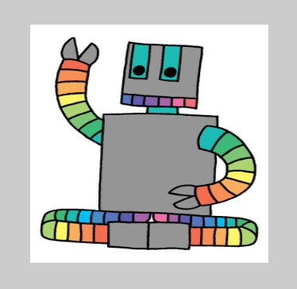

### حمل الصورة

إذا كنت تريد استخدام صورتك الخاصة ، فيمكنك القيام بذلك عن طريق اختيار الزر "عرض وإضافة الصور".

ثم اختر "مكتبة الصور" واتبع الإرشادات التي تظهر على الشاشة لتحميل صورة إلى مكتبة صور Trinket.

**نصيحة:** قم بتدوين اسم ملف الصورة التي قمت بتحميلها حيث ستستخدمها في الكود.

### أضف رمز الصورة

انتقل إلى وظيفة setup() وأضف رمزًا لإنشاء متغير عالمي جديد وقم بتحميل الصورة في:

--- code ---
---
language: python 
filename: main.py - setup()
---

def setup(): 
  global robot 
  robot = load_image('robot.png')

--- /code ---

أضف دالة `image()` إلى المكان الموجود في الشفرة البرمجية حيث تريد رسم صورتك.

تم تحميل الدالة `image()`:

`image(ملف الصورة ,تنسيق x, تنسيق y, العرض ,الارتفاع)`

تنسق الإحداثيات موضع أعلى يسار الصورة.

--- code ---
---
language: python
---

  image(robot, 50, 50, 300, 300)

--- /code ---

