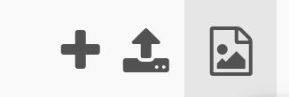

### Μεταφόρτωση εικόνας

Εάν θέλεις να χρησιμοποιήσεις τη δική σου εικόνα, μπορείς να το κάνεις επιλέγοντας το κουμπί "View and add images" (Προβολή και προσθήκη εικόνων).

Στη συνέχεια, επίλεξε Image Library και ακολούθησε τις οδηγίες που εμφανίζονται στην οθόνη για να ανεβάσεις μια εικόνα στη βιβλιοθήκη εικόνων Trinket.

**Συμβουλή:** Σημείωσε το όνομα αρχείου για την εικόνα που ανέβασες καθώς θα το χρησιμοποιήσεις στον κώδικα.

### Προσθήκη κώδικα εικόνας

Go to the setup() function and add code, create a new global variable and load the image in:

--- code ---
---
language: python filename: main.py - setup()

---

def setup(): global robot robot = load_image('robot.png')

--- /code ---

Πρόσθεσε τη συνάρτηση `image()` στη θέση του κώδικα όπου θέλεις να σχεδιάσεις την εικόνα σου.

Παρατίθεται η συνάρτηση `image()`:

`image(αρχείο εικόνας, τετμημένη, τεταγμένη, πλάτος, ύψος)`

Οι συντεταγμένες τοποθετούν το επάνω αριστερό μέρος της εικόνας.

--- code ---
---
language: python

---

  image(robot, 50, 50, 300, 300)

--- /code ---

